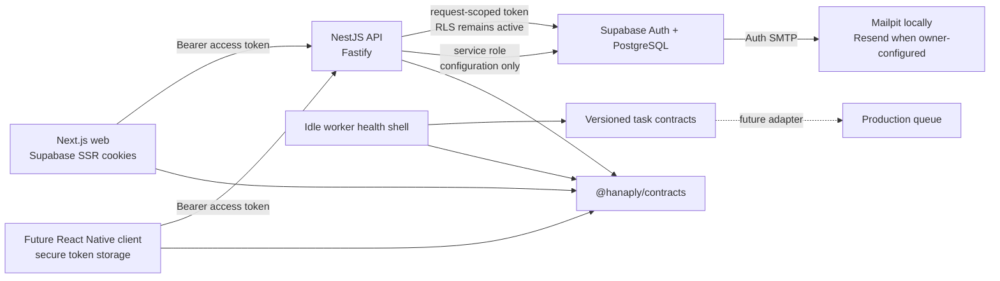

# Architecture

## System boundary

The API is the authoritative orchestration boundary. The web application renders presentation, refreshes Supabase cookies, and sends bearer tokens to the API. It does not decide plans, account status, entitlements, admin roles, permissions, feature rules, or platform lifecycle state.

## Workspace responsibilities

| Boundary                                | Responsibility                                                                                                                             |
| --------------------------------------- | ------------------------------------------------------------------------------------------------------------------------------------------ |
| `apps/web`                              | Marketing, auth UI, protected customer/admin layouts, Supabase SSR cookie handling, CSP, and the shared API client                         |
| `services/api`                          | Validation, bearer authentication, account-status enforcement, authorization, rate limiting, OpenAPI, repositories, and response envelopes |
| `services/worker`                       | Liveness/readiness, graceful shutdown, queue interfaces, retry policy, and idle-mode truthfulness                                          |
| `packages/contracts`                    | One route registry, Zod request/response/error schemas, OpenAPI 3.1, DOM-free fetch transport, and task envelopes                          |
| `packages/database`                     | Supabase client factories, generated schema types, and explicit snake_case boundaries                                                      |
| `packages/auth`                         | Identity validation, redirect sanitization, account-state decisions, and explicit permission primitives/matrix                             |
| `packages/entitlements`                 | Subscription timing and complete, fail-closed entitlement evaluation                                                                       |
| `packages/platform`                     | Prioritized feature targeting and semantic-version platform evaluation                                                                     |
| `packages/ai`                           | Disabled provider-neutral AI boundary                                                                                                      |
| `packages/email`                        | Versioned templates plus disabled, capture, and production-gated Resend adapters                                                           |
| `packages/observability`                | AsyncLocalStorage context, Pino labels, and sensitive-field redaction                                                                      |
| `packages/design-tokens`, `packages/ui` | Canonical visual tokens and accessible reusable primitives                                                                                 |

Runtime-neutral packages avoid DOM and Node-only dependencies when mobile reuse is expected. Database rows remain snake_case; repository mappers return camelCase contract objects.

## Contract flow

Each REST operation is declared once in `@hanaply/contracts` with its method, path, auth class, query schema, success schema, and operation metadata. The registry drives:

1. Controller paths and inferred TypeScript types.
2. Runtime request and outgoing response validation.
3. The shared fetch client used by web and future mobile clients.
4. The checked-in OpenAPI 3.1 artifact and local `/openapi.json` endpoint.

Successful responses contain `data` and `meta.apiVersion/requestId`. Errors contain a safe `error` object and the same metadata. Internal exceptions are never serialized directly.

## Phase 1 endpoints

| Endpoint                                        | Boundary                                                        |
| ----------------------------------------------- | --------------------------------------------------------------- |
| `GET /v1/health`                                | Public liveness; no dependency check                            |
| `GET /v1/ready`                                 | Public readiness; verifies database connectivity                |
| `GET /v1/version`                               | Public API/service/build version                                |
| `GET /v1/meta`                                  | Public platform and client-exposed feature evaluation           |
| `GET /v1/plans`                                 | Active database-backed plans and allowlisted entitlements       |
| `GET /v1/me`                                    | Active bearer-authenticated profile and subscription summary    |
| `PATCH /v1/me`                                  | Allowlisted profile update                                      |
| `GET/PATCH /v1/me/preferences`                  | Caller-owned optional notification preferences                  |
| `GET /v1/me/sessions`                           | Safe caller session summaries                                   |
| `POST /v1/me/sessions/revoke-others`            | Revoke all non-current sessions                                 |
| `GET /v1/me/entitlements`                       | Server-evaluated caller entitlements                            |
| `GET /v1/admin/me`                              | Active admin membership, roles, and permissions from PostgreSQL |
| `GET /v1/admin/overview`                        | Permissioned real identity/account totals                       |
| `GET /v1/admin/users`                           | Filtered, paginated user directory                              |
| `GET /v1/admin/users/{userId}`                  | Safe user/account/subscription detail                           |
| `POST /v1/admin/users/{userId}/suspend`         | Audited account suspension                                      |
| `POST /v1/admin/users/{userId}/restore`         | Audited suspension restoration                                  |
| `POST /v1/admin/users/{userId}/revoke-sessions` | Audited full session revocation                                 |
| `GET /v1/admin/audit-events`                    | Filtered, redacted audit directory                              |
| `GET /v1/admin/security`                        | Safe implementation/configuration diagnostics                   |
| `/openapi.json`, `/docs`                        | Local/test documentation; production-disabled by configuration  |

## Authentication and authorization sequence

1. Same-origin server actions send registration/login/recovery operations directly to Supabase Auth after shared validation and database-backed throttling.
2. Supabase Auth provisions/reconciles the application profile, legal records, preferences, and security history through protected triggers/functions.
3. Next.js Proxy refreshes cookies, adds a CSP nonce, and performs optimistic route redirects.
4. Protected server layouts verify Supabase claims, enforce account status, and call the API.
5. The API accepts only `Authorization: Bearer`, verifies the token with Supabase `getClaims`, and confirms the `session_id` remains active.
6. Caller-token repositories preserve RLS for user profile/subscription reads; narrowly scoped service functions handle admin operations and re-check actor permissions.
7. Suspended, disabled, and pending-deletion accounts are rejected before protected orchestration.
8. Admin access is resolved through `get_my_admin_access`; JWT metadata is ignored for roles/permissions.
9. Controller guards require one, any, or all explicit catalog permissions, and privileged database functions enforce them again.

## Worker and provider state

Tasks include version, correlation and idempotency identifiers, timestamps, attempts, and a validated payload. Retry delay is exponential with full jitter, defaults to five attempts, and caps at 15 minutes. Dead-letter metadata deliberately omits payloads.

The queue and AI providers remain disabled. Active worker mode fails startup and AI calls reject.

Email now has disabled, in-memory capture, and Resend implementations. Resend can start only outside local/test with a validated key/sender and explicit live-send gate. Supabase Auth owns verification/recovery transport; local messages go to Mailpit and hosted Resend SMTP remains an owner configuration task. No live provider call was made during Phase 1 validation.

Phase 1 adds no payment, job, document, AI, push, or queue-consumer operation. The Activation Center and dashboards expose real account/subscription state with honest deferred-feature copy.
