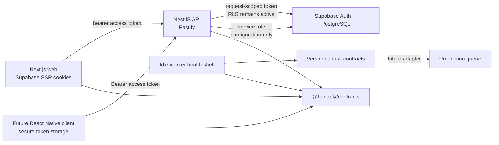

# Architecture

## System boundary

The API is the authoritative orchestration boundary. The web application renders presentation, refreshes Supabase cookies, and sends bearer tokens to the API. It does not decide plans, account status, entitlements, admin roles, permissions, feature rules, or platform lifecycle state.

## Workspace responsibilities

| Boundary                                | Responsibility                                                                                                                             |
| --------------------------------------- | ------------------------------------------------------------------------------------------------------------------------------------------ |
| `apps/web`                              | Marketing, auth UI, protected customer/admin layouts, Supabase SSR cookie handling, CSP, and the shared API client                         |
| `services/api`                          | Validation, bearer authentication, account-status enforcement, authorization, rate limiting, OpenAPI, repositories, and response envelopes |
| `services/worker`                       | Liveness/readiness, graceful shutdown, queue interfaces, retry policy, and idle-mode truthfulness                                          |
| `packages/contracts`                    | One route registry, Zod request/response/error schemas, OpenAPI 3.1, DOM-free fetch transport, and task envelopes                          |
| `packages/database`                     | Supabase client factories, generated schema types, and explicit snake_case boundaries                                                      |
| `packages/auth`                         | Redirect sanitization and explicit permission primitives/matrix                                                                            |
| `packages/entitlements`                 | Subscription timing and complete, fail-closed entitlement evaluation                                                                       |
| `packages/platform`                     | Prioritized feature targeting and semantic-version platform evaluation                                                                     |
| `packages/ai`, `packages/email`         | Provider-neutral contracts with disabled Phase 0 implementations                                                                           |
| `packages/observability`                | AsyncLocalStorage context, Pino labels, and sensitive-field redaction                                                                      |
| `packages/design-tokens`, `packages/ui` | Canonical visual tokens and accessible reusable primitives                                                                                 |

Runtime-neutral packages avoid DOM and Node-only dependencies when mobile reuse is expected. Database rows remain snake_case; repository mappers return camelCase contract objects.

## Contract flow

Each REST operation is declared once in `@hanaply/contracts` with its method, path, auth class, query schema, success schema, and operation metadata. The registry drives:

1. Controller paths and inferred TypeScript types.
2. Runtime request and outgoing response validation.
3. The shared fetch client used by web and future mobile clients.
4. The checked-in OpenAPI 3.1 artifact and local `/openapi.json` endpoint.

Successful responses contain `data` and `meta.apiVersion/requestId`. Errors contain a safe `error` object and the same metadata. Internal exceptions are never serialized directly.

## Phase 0 endpoints

| Endpoint                  | Boundary                                                        |
| ------------------------- | --------------------------------------------------------------- |
| `GET /v1/health`          | Public liveness; no dependency check                            |
| `GET /v1/ready`           | Public readiness; verifies database connectivity                |
| `GET /v1/version`         | Public API/service/build version                                |
| `GET /v1/meta`            | Public platform and client-exposed feature evaluation           |
| `GET /v1/plans`           | Active database-backed plans and allowlisted entitlements       |
| `GET /v1/me`              | Active bearer-authenticated profile and subscription summary    |
| `GET /v1/me/entitlements` | Server-evaluated caller entitlements                            |
| `GET /v1/admin/me`        | Active admin membership, roles, and permissions from PostgreSQL |
| `/openapi.json`, `/docs`  | Local/test documentation; production-disabled by configuration  |

## Authentication and authorization sequence

1. Next.js Proxy refreshes cookies, adds a CSP nonce, and performs optimistic route redirects.
2. Protected server layouts verify Supabase claims and call the API.
3. The API accepts only `Authorization: Bearer` and verifies the token with Supabase `getClaims`.
4. The repository uses the caller token for profile/subscription queries so RLS remains active.
5. Suspended and closed accounts are rejected before protected orchestration.
6. Admin access is resolved through `get_my_admin_access`; JWT metadata is ignored for permissions.
7. Controller guards can require one, any, or all explicit catalog permissions.

## Worker and provider state

Tasks include version, correlation and idempotency identifiers, timestamps, attempts, and a validated payload. Retry delay is exponential with full jitter, defaults to five attempts, and caps at 15 minutes. Dead-letter metadata deliberately omits payloads.

The queue, email, and AI providers are disabled implementations. Active worker mode fails startup, email returns a disabled receipt, and AI calls reject. No API key is read by a live provider in Phase 0.
