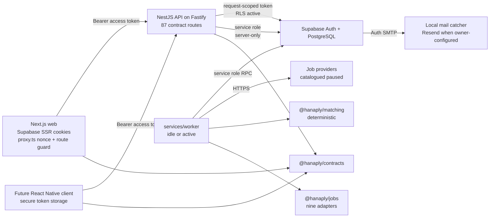

# Architecture

## System boundary

The API is the authoritative orchestration boundary. The web application renders presentation, refreshes Supabase cookies, and sends bearer tokens to the API. It does not decide plans, account status, entitlements, admin roles, permissions, feature rules, platform lifecycle state, match scores, or job visibility.

## Workspace responsibilities

| Boundary                                | Responsibility                                                                                                                                                                                                                                                 |
| --------------------------------------- | -------------------------------------------------------------------------------------------------------------------------------------------------------------------------------------------------------------------------------------------------------------- |
| `apps/web`                              | Marketing, auth UI, customer and admin App Router surfaces, Supabase SSR cookie handling, CSP and security headers through `src/proxy.ts`, server actions, and the shared API client                                                                           |
| `services/api`                          | Zod-validated request and response handling, bearer authentication, session liveness, account-status enforcement, permission guards, rate limiting, OpenAPI, repositories, file validation, and deterministic resume extraction                                |
| `services/worker`                       | Health and readiness server, payment maintenance (expiry, reminders, payment notification outbox, private-object cleanup), and the job intelligence worker (ingestion, match computation, freshness, opportunity notification delivery)                        |
| `packages/contracts`                    | One route registry, Zod request/response/error schemas, the DOM-free fetch client, OpenAPI 3.1 generation, and task envelopes                                                                                                                                  |
| `packages/jobs`                         | Source adapter contract, nine provider adapters, the deterministic normalizer, multi-signal dedupe scoring, and the ingestion runner                                                                                                                           |
| `packages/matching`                     | The deterministic nine-dimension matching engine, requirement mapping, verdict and confidence computation                                                                                                                                                      |
| `packages/database`                     | Supabase client factories, generated schema types, and explicit snake_case boundaries                                                                                                                                                                          |
| `packages/auth`                         | Identity validation, redirect sanitization, account-state decisions, and explicit permission primitives and matrix                                                                                                                                             |
| `packages/config`                       | Zod environment schemas for browser, web server, API, worker, email, and bootstrap scopes                                                                                                                                                                      |
| `packages/entitlements`                 | Subscription timing and complete, fail-closed entitlement evaluation                                                                                                                                                                                           |
| `packages/platform`                     | Prioritized feature targeting and semantic-version platform evaluation                                                                                                                                                                                         |
| `packages/ai`                           | Provider-neutral AI boundary: `createAiProvider`, three implementations (disabled, OpenAI-compatible, deterministic fake), prompt construction, and the per-claim truth gate. Wired into the API and web application; see [AI integration](ai-integration.md). |
| `packages/email`                        | Versioned templates plus disabled, capture, and production-gated Resend adapters                                                                                                                                                                               |
| `packages/observability`                | AsyncLocalStorage context, Pino labels, and sensitive-field redaction                                                                                                                                                                                          |
| `packages/design-tokens`, `packages/ui` | Canonical visual tokens and accessible reusable primitives                                                                                                                                                                                                     |
| `packages/testing`                      | Shared test helpers                                                                                                                                                                                                                                            |

Runtime-neutral packages avoid DOM and Node-only dependencies where mobile reuse is expected. Database rows remain snake_case; repository mappers return camelCase contract objects.

## The product loop and its owners

| Step                          | Owner                                                                                                | Notes                                                                                                                        |
| ----------------------------- | ---------------------------------------------------------------------------------------------------- | ---------------------------------------------------------------------------------------------------------------------------- |
| Career profile and records    | `/v1/me/career/*` in `services/api` → `career_profiles` and related tables                           | Limits enforced inside `public.create_career_profile` and `public.upsert_career_record`                                      |
| Resume upload and extraction  | `services/api/src/career-files.ts` validates bytes; `career-extraction.ts` parses                    | Deterministic; produces a `needs_review` draft, never a trusted record                                                       |
| Truth ledger                  | `public.record_career_facts` and `public.decide_career_fact`                                         | Only `user_entered` facts are auto-confirmed; extraction results start as `candidate`                                        |
| Job ingestion                 | `services/worker/src/jobs.ts` + `@hanaply/jobs` → `public.upsert_ingested_job`                       | One shared scan per source; see [Job ingestion](job-ingestion.md)                                                            |
| Deduplication                 | `public.upsert_ingested_job` proposes merges; `packages/jobs/src/dedupe.ts` scores review candidates | Provenance is retained per source posting                                                                                    |
| Freshness                     | `public.refresh_job_freshness`, driven by the worker's freshness cycle                               | Active → stale → expired                                                                                                     |
| Match computation             | `@hanaply/matching` scored in the worker, persisted by `public.record_job_matches`                   | Scores are cached in `job_matches`; see [AI and truth gating](ai-and-truth-gating.md)                                        |
| Radar feed and job detail     | `public.job_radar` and `public.job_detail`, exposed as `/v1/me/jobs*`                                | Ranking reads cached matches, so an unscored job sorts after scored ones                                                     |
| Save, unsave, feedback        | `public.save_job`, `public.unsave_job`, `public.record_job_feedback`                                 | Negative feedback removes a posting from `matching_job_candidates`                                                           |
| Application packs and usage   | `public.create_application_pack`, `app_private.consume_usage`, artifact truth gate                   | Creation, listing, detail, allowance display, and deterministic artifact generation ship                                     |
| Pack artifact generation      | `public.generate_application_pack_artifacts` + `services/api/src/pack-generation.ts`                 | The database supplies context and refuses foreign packs; a ready pack always has an artifact                                 |
| AI opportunity analysis       | `services/api/src/ai.*` → `public.record_opportunity_analysis`, `public.record_ai_invocation`        | Grounded reasoning about one opportunity, cached by evidence fingerprint; score and confidence stay with `@hanaply/matching` |
| AI coach threads              | `services/api/src/ai.*` → `public.open_coach_conversation`, `public.append_coach_message`            | Facts and suggestions are separate columns, and an uncited factual claim is unstorable                                       |
| Application tracker           | `public.upsert_job_application`, `public.set_application_stage`, `public.application_timeline`       | Board, per-stage grouping, notes, next actions, and timeline ship                                                            |
| Manual payment and activation | `services/api/src/payment.*` → `public.approve_payment_submission` and friends                       | No payment-provider integration; approval is an authorized manual decision                                                   |
| Entitlement resolution        | `packages/entitlements` in the API and `app_private.career_entitlements` in SQL                      | Both fail closed; see [Entitlements](entitlements.md)                                                                        |

## Contract flow

The single canonical route registry is `packages/contracts/src/api-contract.ts`, which declares `export const apiContract = Object.freeze({ ... })` with 87 entries. Each entry is wrapped by the local `defineRoute` helper and carries `method` (`GET`, `PATCH`, `POST`, or `DELETE`), `path` (`` `/v1/${string}` ``), `operationId`, `summary`, `auth` (`'public' | 'user' | 'admin'`), `successStatus`, and the optional `query`, `params`, `body`, `multipartBody`, and `response` schemas.

There is no group or permission field in the registry. Permissions live on the Nest controllers as `@RequirePermission`, `@RequireAllPermissions`, and `@RequireAnyPermission` metadata, and every route's `successStatus` is the literal `200`.

The registry drives:

1. Controller paths and inferred TypeScript types.
2. Runtime request and outgoing response validation.
3. The shared fetch client used by the web and future mobile clients — `client.ts` exposes exactly one method per contract entry.
4. The checked-in OpenAPI 3.1 artifact at `packages/contracts/openapi.generated.json` and the local `/openapi.json` endpoint.

Successful responses contain `data` and `meta.apiVersion` / `meta.requestId`. Errors contain a safe `error` object from the 11-value `errorCodeSchema` plus the same metadata. Internal exceptions are never serialized directly; `ApiExceptionFilter` in `services/api/src/infrastructure.ts` maps `ZodError` to `VALIDATION_ERROR`, `AppError` to its own status and code, and other exceptions through an allowlist.

## API route families

Counted from `apiContract`: 99 operations — 5 public, 55 authenticated-user, and 39 admin. Grouping below is by path prefix, because the registry has no explicit group field. The family counts cover the career, radar, application-pack, and payment surfaces; the notification, admin job-operations, and career-insights routes were added after this table was written, which is why the rows below sum to less than the total above.

| Family                            | Routes | Contract key examples                                                                                                                                                                               |
| --------------------------------- | -----: | --------------------------------------------------------------------------------------------------------------------------------------------------------------------------------------------------- |
| Public core and plan catalog      |      5 | `health`, `ready`, `version`, `meta`, `plans`                                                                                                                                                       |
| Caller identity and settings      |      9 | `me`, `updateMe`, `preferences`, `updatePreferences`, `sessions`, `revokeOtherSessions`, `entitlements`                                                                                             |
| Caller payment methods            |      1 | `paymentMethods`                                                                                                                                                                                    |
| Caller subscription and payments  |     10 | `mySubscription`, `myPaymentSubmissions`, `createPaymentSubmission`, `uploadPaymentProof`, `submitPaymentSubmission`, `cancelPaymentSubmission`, `resubmitPaymentSubmission`                        |
| Career intelligence profile       |     21 | `careerProfiles`, `careerProfile`, `upsertCareerRecord`, `recordCareerFacts`, `decideCareerFact`, `careerDocuments`, `uploadCareerDocument`, `applyCareerDocumentExtraction`, `setOnboardingStatus` |
| Career Radar                      |      5 | `jobRadar`, `jobDetail`, `saveJob`, `unsaveJob`, `recordJobFeedback`                                                                                                                                |
| Application packs, usage, tracker |      9 | `applicationPacks`, `createApplicationPack`, `applicationPack`, `generateApplicationPack`, `usageSummary`, `applicationTracker`, `trackApplication`, `applicationTimeline`, `setApplicationStage`   |
| Admin core                        |      9 | `adminMe`, `adminOverview`, `adminUsers`, `adminUser`, `adminSuspendUser`, `adminRestoreUser`, `adminRevokeUserSessions`, `adminAudit`, `adminSecurity`                                             |
| Admin payment methods             |      8 | `adminPaymentMethods`, `createAdminPaymentMethod`, `enableAdminPaymentMethod`, `uploadAdminPaymentMethodQr`                                                                                         |
| Admin payment review              |      9 | `adminPaymentSubmissions`, `startPaymentReview`, `requestPaymentInformation`, `approvePaymentSubmission`, `rejectPaymentSubmission`, `recordPaymentRefund`, `reversePaymentApproval`                |
| Admin subscriptions               |      3 | `adminSubscriptions`, `adminSubscription`, `correctAdminSubscription`                                                                                                                               |

Those families sum to 88 as listed. The three comment banners inside `api-contract.ts` group the career, radar, and application-pack sections explicitly; every other family above is inferred from the path prefix.

`DocumentationController` additionally serves `GET /openapi.json` and `GET /docs`, which are not contract entries. Both are available only when `OPENAPI_ENABLED` is true and `HANAPLY_ENV` is not `production`.

Controllers: `PublicController` (5 handlers), `UserController` (7), `CustomerPaymentController` (12), `CareerController` (35), `AdminController` (9), `AdminPaymentController` (20), and `DocumentationController` (2). Those sum to 88. The registry is the source of truth: this list describes the controllers above and not any route family added after it was written.

## Trust boundary

1. **The browser never receives the job table.** The web application holds no Supabase query for jobs, sources, companies, or matches. Every read goes through the API as an authenticated `/v1/me/...` call, the API holds the service-role key server-side, and the browser only ever sees the response schema declared in the registry. Row-level security is a second, independent barrier: `jobs` has a policy permitting `select` only where `status = 'active'`, and `job_sources` only where `status = 'active'`, so even a leaked publishable key cannot read paused providers, provenance rows, ingestion runs, or dedup candidates.
2. **The API is the authoritative orchestration boundary.** Authorization, account status, session liveness, entitlement resolution, rate limiting, file validation, and response shaping all happen in `services/api` or in SQL functions that the API calls with the service role. Presentation-layer checks in `apps/web` are convenience only; the API and the database re-check them.
3. **The service role is server-only.** `SUPABASE_SERVICE_ROLE_KEY` is read by `services/api`, `services/worker`, `tooling/bootstrap-super-admin.mjs`, and the Playwright fixtures. `parseBrowserEnvironment` strips it, so it can never reach a `NEXT_PUBLIC_` value, and no public endpoint proxies arbitrary service-role requests. Privileged SQL functions call `app_private.require_service_role()` and then independently verify the supplied actor's database permission, so holding the service key is not by itself authority to act as an administrator.
4. **Writes are function-mediated.** Every RLS policy except `profiles_update_own_active` is `for select` only. Inserts, updates, and deletes reach the database exclusively through `security definer` functions with `set search_path = ''`, revoked from `public`, `anon`, and `authenticated`. Direct table writes from a browser client fail by construction.
5. **Web mutation origin is verified.** Every server action calls `assertTrustedMutationOrigin()` from `apps/web/src/lib/request-integrity.ts` before doing anything else, and `src/proxy.ts` sets a per-request CSP nonce plus `frame-ancestors 'none'`.

## Authentication and authorization sequence

1. Same-origin server actions send registration, login, and recovery operations directly to Supabase Auth after shared validation and database-backed throttling through `public.consume_auth_rate_limit`.
2. Supabase Auth provisions and reconciles the application profile, legal records, preferences, and security history through protected triggers and functions.
3. `apps/web/src/proxy.ts` refreshes cookies, adds the CSP nonce and security headers, and performs optimistic route redirects for `/dashboard*` and `/admin*` except `/admin/login`.
4. Protected server layouts call `requireUser()` or `requireAdmin()`, enforce account status, and build an API client with the session access token.
5. The API accepts only `Authorization: Bearer`, verifies the token with Supabase `getClaims`, requires `sub` and `session_id`, and confirms the session is still active through `is_auth_session_active`.
6. Caller-token repositories preserve RLS for user reads; narrowly scoped service functions handle admin operations and re-check actor permissions.
7. Suspended, disabled, and pending-deletion accounts are rejected before protected orchestration.
8. Admin access is resolved through `get_my_admin_access`; JWT metadata is ignored for roles and permissions.
9. Controller guards require one, all, or any explicit catalog permission, and the privileged database functions enforce the same permission again.

## Worker topology

`services/worker` always serves health on `WORKER_HEALTH_PORT` (default `3102`). `WORKER_MODE=idle` serves health only. `WORKER_MODE=active` additionally constructs `PaymentMaintenanceWorker` and `JobIntelligenceWorker`. `WORKER_MODE=once` runs every job-intelligence cycle a single time through the same `JobIntelligenceWorker.runOnce`, prints the worker's own state as the last line of stdout, and exits non-zero when a cycle reported an error. It exists so a deterministic gate can start the real orchestration, wait for the process to finish, and then read the rows it produced: `tests/e2e/worker-cycle.ts` is the caller, and `pnpm e2e` builds `services/worker/dist/main.js` for it.

Both the API and the worker bind the port the hosting platform routes to: an injected `PORT` takes precedence over `API_PORT` and `WORKER_HEALTH_PORT`, which keep their local defaults. A service that binds a port the router does not target starts cleanly, reports itself healthy in its own logs, and still receives no traffic, so this is the one setting a platform is allowed to override.

- `PaymentMaintenanceWorker` runs subscription expiry and reminders (RPC `queue_subscription_expiry_reminders`, `expire_subscriptions`) on the maintenance interval, and runs notification delivery (RPC `claim_payment_notifications`, `complete_payment_notification`, `release_payment_notification_claim`) and private-object cleanup (RPC `claim_storage_cleanup_jobs`, `complete_storage_cleanup_job`, `release_storage_cleanup_job`) on every poll.
- `JobIntelligenceWorker` runs four bounded cycles on one timer: ingestion (RPC `job_ingestion_schedule`, `acquire_ingestion_lock`, `start_ingestion_run`, `upsert_ingested_job`, `complete_ingestion_run`, `release_ingestion_lock`), match computation (RPC `matching_subjects`, `career_profile_detail`, `confirmed_career_evidence`, `matching_job_candidates`, `record_job_matches`), freshness (RPC `refresh_job_freshness`), and opportunity notification delivery (RPC `queue_job_alert_notifications`, `queue_job_digest_notifications`, `claim_notification_outbox`, `complete_notification_outbox`, `release_notification_outbox`). Delivery runs through the configured email provider, which defaults to `disabled`. See [Job ingestion](job-ingestion.md).

Both workers poll on `WORKER_POLL_INTERVAL_MS` (default 5000) and use `WORKER_MAINTENANCE_INTERVAL_MS` (default 300000) for slower maintenance. Both are idempotent: repeated cycles re-derive the same work from the database, and a partially completed cycle is picked up again.

### Scheduling constraint

`WORKER_MODE=active` is a long-running daemon and needs a host that keeps a process alive between requests. It is correct locally, in a container, or on a VM, and it is not correct on a request-triggered platform, where the process is stopped when no request is in flight and the poll timer therefore never fires. Deploying `services/worker` as a request-triggered service gives a service that answers `/health` and `/ready` while running none of the cycles either endpoint reports on.

A request-triggered host must instead drive `WORKER_MODE=once`, which runs every cycle a single time and exits with the worker's own status, from a scheduler. That is the same entry point `pnpm e2e` uses, so a scheduled deployment and the deterministic gate exercise identical orchestration. The cycles are idempotent and the ingestion cycle takes a database lock, so overlapping or repeated invocations are safe.

`services/worker/src/queue.ts` defines `TaskQueue`, `DisabledQueueAdapter`, `InMemoryTaskQueue`, `retryDelayMilliseconds` (full-jitter exponential, capped at 15 minutes), and `isRetryableTaskError`. No production queue is wired into the worker runtime; the only importer is `tests/unit/tasks.test.ts`. The live worker calls Supabase RPCs directly.

## Provider state

Tasks include version, correlation and idempotency identifiers, timestamps, attempts, and a validated payload, but the production queue remains disabled. `@hanaply/ai` ships four implementations — `DisabledAiProvider`, `OpenAiCompatibleProvider`, `FakeAiProvider`, and the resolver `createAiProvider` — and `services/api` imports it: the API resolves one provider per process and injects it as `AI_PROVIDER_TOKEN`, so a test can substitute the deterministic fake exactly as it substitutes a repository. `AI_PROVIDER` defaults to `disabled`, which is the state every environment in this repository runs in; see [AI integration](ai-integration.md) for the routes, metering, and degraded behaviour.

All five catalogued job providers start `paused`, so the worker's ingestion cycle has nothing due until an operator enables a source. Adzuna and Jooble additionally need `ADZUNA_APP_ID`/`ADZUNA_APP_KEY` and `JOOBLE_API_KEY` in the worker environment.

Email has disabled, in-memory capture, and Resend implementations. Resend can start only outside local and test with a validated key, sender, and explicit live-send gate. Supabase Auth owns verification and recovery transport; hosted Resend SMTP remains an owner configuration task. No live provider call was made during local validation.
